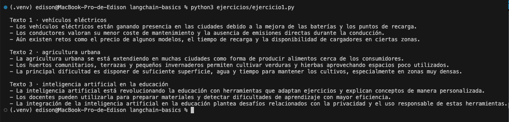
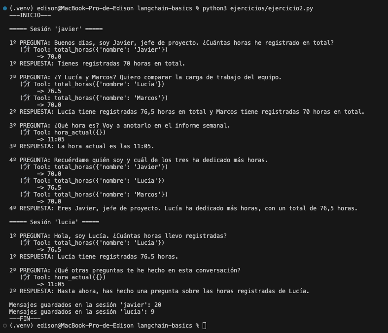

# langchain-basics · Master AI Engineer · Sesion 4

Proyecto de clase: las piezas basicas de LangChain, una por archivo, en el orden de la sesion,
mas mis soluciones a los dos ejercicios para casa (carpeta `ejercicios/`).
Todo corre en local con Ollama (llama3.1): coste de API 0 EUR.

## Puesta en marcha
1. Instala Ollama (https://ollama.com) y descarga el modelo: `ollama pull llama3.1`
2. Crea el entorno: `python -m venv .venv` y activalo (`source .venv/bin/activate` en macOS/Linux, `.venv\Scripts\activate` en Windows)
3. Instala dependencias: `pip install -r requirements.txt`

## Estructura
```
langchain-basics/
├── 00_hola.py … 04_tool.py   # pasos de clase
├── extras/                   # variaciones vistas en clase
├── ejercicios/
│   ├── ejercicio1.py         # resumidor LCEL
│   └── ejercicio2.py         # chat con memoria + tools
├── capturas/                 # ejecuciones de los ejercicios
│   ├── ejercicio1.png        # ejecución del ejercicio 1
│   └── ejercicio2.png        # ejecución del ejercicio 2
├── datos.csv                 # registro de horas usado por el ejercicio 2
└── requirements.txt
```

## Los pasos de clase
| Archivo | Pieza de LangChain | Que demuestra |
|---|---|---|
| `00_hola.py` | Models | Python habla con el modelo local; devuelve un `AIMessage` |
| `01_chain.py` | Prompts + Parsers + LCEL | `prompt \| modelo \| parser` traduce al ingles y devuelve texto limpio |
| `02_compuesta.py` | Chains compuestas | Generar -> resumir con `RunnablePassthrough.assign`, viendo el paso intermedio |
| `03_memoria.py` | Memory | `RunnableWithMessageHistory`: recuerda por `session_id` |
| `04_tool.py` | Tools | `@tool` + `bind_tools`: el modelo pide la llamada, nuestro codigo la ejecuta |

Ejecuta cada uno con `python <archivo>`.

### Extras (variaciones vistas en clase)
- `extras/paso2_batch.py` · la misma cadena traduce una lista con `batch`
- `extras/paso3_tres_etapas.py` · tercera etapa: generar -> resumir -> traducir
- `extras/paso4_que_ve_el_modelo.py` · que mensajes se reenvian al modelo en cada llamada
- `extras/paso5_esquema_tool.py` · el esquema que ve el modelo de una tool y su tool call en crudo

---

## Mis soluciones

### Ejercicio 1 · Resumidor con LCEL
```
python ejercicios/ejercicio1.py
```
Cadena `prompt | modelo | parser` que resume un texto largo en 3 viñetas.

- **Prompt:** un mensaje de sistema que exige exactamente 3 viñetas que empiecen por `-`, sin introducción ni cierre.
- **Modelo:** `ChatOllama(llama3.1)` con `temperature=0` para que la salida sea estable.
- **Parser:** `StrOutputParser` para quedarse con el texto del `AIMessage`. El formato de 3 viñetas se controla desde el prompt.
- Se prueba con 3 textos distintos: vehículos eléctricos, agricultura urbana e IA en la educación.



### Ejercicio 2 · Reto: memoria + herramientas
```
python ejercicios/ejercicio2.py
```
Asistente de gestión de proyectos con memoria por `session_id` que consulta un CSV propio (`datos.csv`).

**Herramientas**
- `total_horas(nombre)`: lee `datos.csv` con pandas y devuelve las horas totales registradas por una persona. Si el nombre no existe, devuelve un aviso con las personas válidas en lugar de fallar.
- `hora_actual()`: devuelve la hora del sistema.

**Memoria por sesión**
- `historiales` guarda una lista de mensajes por `session_id`, y cada sesión nueva empieza con su propio system prompt.
- En el historial se guardan la pregunta, la tool call, los `ToolMessage` y la respuesta final, así que el modelo recuerda también los resultados de las tools.
- El bucle `while ai.tool_calls` ejecuta las tools que pida el modelo hasta que responde con texto.

**Conversación de prueba**
- Sesión `javier`: pregunta sus horas, después "¿Y Lucía y Marcos?" (solo se entiende con la memoria del turno anterior), la hora, y al final "recuérdame quién soy y quién ha dedicado más horas".
- Sesión `lucia` (control): obtiene sus propias horas y no ve nada de la conversación de Javier.

Valores esperados según `datos.csv`: Javier 70 h, Lucía 76,5 h y Marcos 70 h.



**Decisiones**
- La memoria se gestiona con un diccionario de listas en lugar de `RunnableWithMessageHistory`. Ese componente está deprecado en LangChain 1.x, y llevar la lista a mano deja a la vista el bucle modelo -> tool -> modelo que la próxima sesión convierte en un grafo con LangGraph.
- `datos.csv` es un registro de horas sintético: 74 filas del 21/09 al 02/10/2026, con 3 proyectos y 5 personas. Columnas: `fecha, proyecto, empleado, rol, tarea, horas, facturable`.

**Limitaciones observadas**
- llama3.1 (8B) a veces llama a una tool aunque el dato ya esté en la conversación. Por ejemplo, en el último turno de Javier vuelve a consultar las tres horas. La respuesta sigue siendo correcta.
- El bucle de tools no tiene límite de iteraciones. En producción habría que añadirlo.

---

## Notas
- La primera llamada tarda mas: Ollama carga el modelo en memoria.
- `RunnableWithMessageHistory` funciona pero esta marcado como deprecado en LangChain 1.x:
  su sustituto es la persistencia de LangGraph.
- Poca RAM (<8 GB)? Usa `llama3.2:3b` y cambia el nombre del modelo en los scripts.
